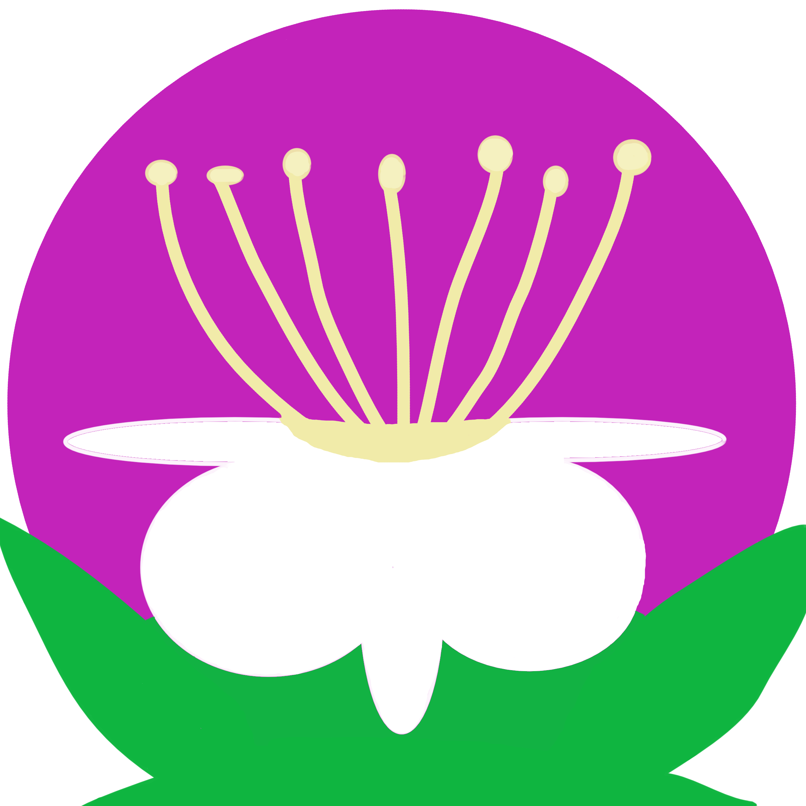

[](https://melpa.org/#/guava-themes)
[](https://stable.melpa.org/#/guava-themes)

# guava-themes
A few Emacs themes inspired by guavas (and other plants).


<!--  -->

### Table of Contents
- [Introduction](#introduction)
- [Installation](#installation)
- [Screenshots](#screenshots)
- [Contributions](#contributions)
- [License](#license)

## Introduction
This package began as an specific idea: *what if I could create an Emacs theme based on my favorite fruit? And what if it was a light theme, but not **too light**?*  
So here it is. My first Emacs package / pack of themes.  
Originally conceived as a tribute to the [guava fruit](https://en.wikipedia.org/wiki/Guava), this pack of themes ended up being inspired by different types of plants I found eye-catching.  
And so, the package name became an Artifact Title, as is known in the tropes community.  

## Installation
- I recommend you use this Emacs code to automatically install **guava-themes** from [MELPA](https://melpa.org/).  
```
(use-package guava-themes
  :ensure t
  :config
  (setq ring-bell-function #'guava-themes-change-visible-bell)
  (setq visible-bell t)
  (load-theme 'guava-themes-psidium t)
  )
```
- You can also download this package directly from the source. This code should work on Emacs 30:  
```
(use-package guava-themes
  :vc (:url "https://github.com/bormoge/guava-themes"
            :rev :newest
            :branch "main"
            :vc-backend Git)
  :ensure t
  :config
  (setq ring-bell-function #'guava-themes-change-visible-bell)
  (setq visible-bell t)
  (load-theme 'guava-themes-psidium t)
  )
```
- If the above code doesn't work you can also try using this one:  
```
(unless (package-installed-p 'guava-themes)
  (package-vc-install "https://github.com/bormoge/guava-themes" nil nil 'guava-themes))

(require 'guava-themes)

(setq ring-bell-function #'guava-themes-change-visible-bell)
(setq visible-bell t)
(load-theme 'guava-themes-psidium t)
```

## Screenshots
- Guava Psidium Theme  


- Guava Jacaranda Theme  


- Guava Prunus Theme  


- Guava Dracaena Theme  


- Guava Acer Theme  


- Guava Cordyline Theme  


- Guava Rhododendron Theme  


- Guava Ceiba Theme  


- Guava Citrus Theme  


- Guava Solanum Theme  


## TODO
- Guava Psidium: slightly change tab-bar and tab-line foreground color.
- Guava Jacaranda Theme: change some font-locks.
- Guava Prunus Theme: change some font-locks and region.
- Guava Dracaena Theme: slightly change font-lock-variable-name-face, highlight, and maybe some other face.

## Contributions
Issues, pull requests, and forks are welcome.

Here is a tentative list of things to consider when contributing:


* When adding or modifying something that changes the visuals of Emacs (e.g. a face), make sure to include screenshots of the original and changed versions.
* When making a pull request, make sure the commits adhere to the [Conventional Commits](https://www.conventionalcommits.org/en/v1.0.0/) specification.
* Make sure commits are modular; one feat/fix/doc/etc at a time.

## License

SPDX-License-Identifier: GPL-3.0-or-later

This program is free software; you can redistribute it and/or modify
it under the terms of the GNU General Public License as published by
the Free Software Foundation, either version 3 of the License, or
(at your option) any later version.

This program is distributed in the hope that it will be useful,
but WITHOUT ANY WARRANTY; without even the implied warranty of
MERCHANTABILITY or FITNESS FOR A PARTICULAR PURPOSE.  See the
GNU General Public License for more details.

You should have received a copy of the GNU General Public License
along with this program.  If not, see <https://www.gnu.org/licenses/>.
